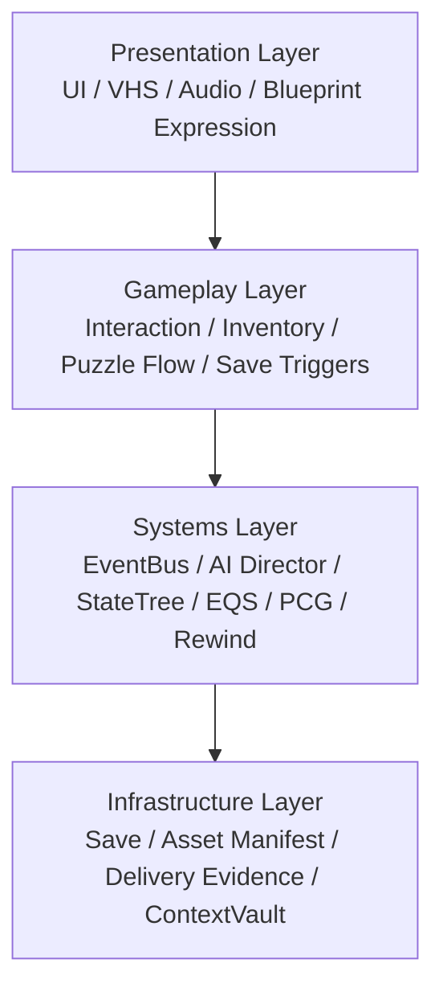

# System Map

## Four layers

### 1. Presentation

Blueprints, UI, post-processing, lighting, audio reaction, cinematic beats.

### 2. Gameplay

Interaction loop, archive matching, puzzle flow, player verbs, world triggers.

### 3. Systems

Global orchestration through subsystems, AI director, event bus, PCG, rewind.

### 4. Infrastructure

Save, inventories, delivery docs, manifests, validation artifacts, runtime evidence.

## Architectural laws

- presentation depends downward, never sideways
- global coordination uses subsystems or interfaces
- evented systems prefer tags over hard-coded pairwise coupling
- runtime debug visibility is mandatory for AI and complex systems
