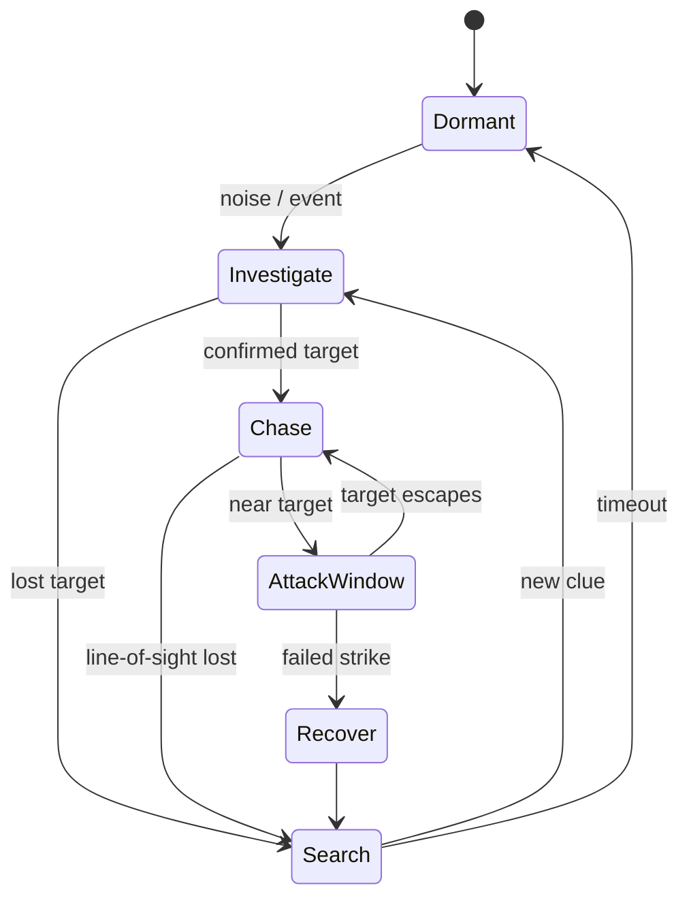

# StateTree Golem

```mermaid
stateDiagram-v2
    [*] --> Dormant
    Dormant --> Investigate: noise / event
    Investigate --> Search: lost target
    Investigate --> Chase: confirmed target
    Search --> Investigate: new clue
    Search --> Dormant: timeout
    Chase --> AttackWindow: near target
    AttackWindow --> Chase: target escapes
    Chase --> Search: line-of-sight lost
    AttackWindow --> Recover: failed strike
    Recover --> Search
```

## Requirements

- every transition must be visible in debug
- blackboard state must be inspectable
- chase intensity should feed the director
