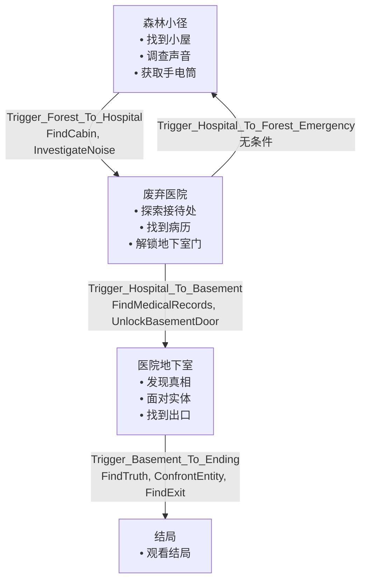

# 关卡流程图

## 关卡详情

### 森林小径
**关卡名称**: `Level_01_ForestPath`
**描述**: 游戏开始的森林区域，玩家需要找到废弃小屋并调查异常

**目标**:
- 🔑 找到小屋: 在森林中找到废弃的小屋
- 🔑 调查声音: 调查小屋内的奇怪声音
- 📋 获取手电筒: 在小屋中找到手电筒

**出生点**:
- `ForestStart`: 森林入口 - 游戏开始位置
- `CabinFront`: 小屋前方 - 用于快速测试

**传送点**:
- Trigger_Forest_To_Hospital → Level_02_Hospital
  - 需要完成: FindCabin, InvestigateNoise

### 废弃医院
**关卡名称**: `Level_02_Hospital`
**描述**: 阴森的废弃医院，充满诡异的气氛和危险

**目标**:
- 📋 探索接待处: 调查医院接待处寻找线索
- 🔑 找到病历: 在医院档案室找到关键病历
- 🔑 解锁地下室门: 使用找到的钥匙打开地下室门
- 📋 躲避怪物: 在医院中躲避巡逻的怪物

**出生点**:
- `HospitalMainEntrance`: 医院主入口 - 从森林传送过来的位置
- `HospitalReception`: 医院接待处 - 快速测试用
- `HospitalSecondFloor`: 医院二楼 - 档案室附近

**传送点**:
- Trigger_Hospital_To_Basement → Level_03_Basement
  - 需要完成: FindMedicalRecords, UnlockBasementDoor
- Trigger_Hospital_To_Forest_Emergency → Level_01_ForestPath

### 医院地下室
**关卡名称**: `Level_03_Basement`
**描述**: 医院最深处的地下室，真相即将揭晓

**目标**:
- 🔑 发现真相: 在地下室深处发现事件的真相
- 🔑 面对实体: 与地下室中的恐怖实体对峙
- 🔑 找到出口: 在混乱中找到逃生出口

**出生点**:
- `BasementStairsTop`: 地下室楼梯顶部 - 从医院下来的位置
- `BasementMainHall`: 地下室主厅 - 测试用

**传送点**:
- Trigger_Basement_To_Ending → Level_04_Ending
  - 需要完成: FindTruth, ConfrontEntity, FindExit

### 结局
**关卡名称**: `Level_04_Ending`
**描述**: 游戏的最终结局场景

**目标**:
- 📋 观看结局: 观看游戏结局动画

**出生点**:
- `EndingStart`: 结局开始位置
